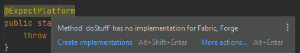

# Architectury IDEA Plugin

An IDEA plugin to help with developing mods using [Architectury](https://github.com/architectury).

## Features

- `@ExpectPlatform` utilities:
  - Navigation between `@ExpectPlatform` declarations and implementations using gutter icons:
    
  - Inspection warnings when there is an unimplemented `@ExpectPlatform`, together with a quick fix
    to create platform implementations:
    
