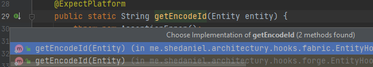

# Architectury IDEA Plugin

An IDEA plugin to help with developing mods using [Architectury](https://github.com/architectury).

## Features

- Provides navigation between `@ExpectPlatform` declarations and implementations using gutter icons.
  
